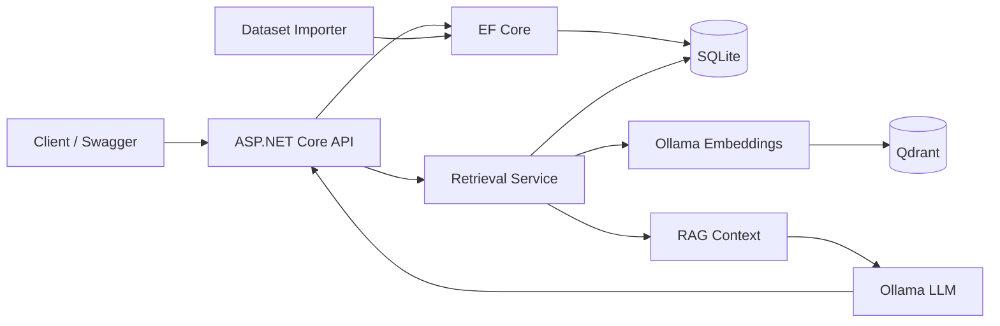

# PauperAdvisor

PauperAdvisor is an experimental backend for **Magic: The Gathering — Pauper** that combines a relational card/ruling database with **Retrieval-Augmented Generation (RAG)**.

The project retrieves semantically relevant cards and official rulings from a local knowledge base and injects that context into a locally hosted LLM through Ollama. It also contains an image-assisted matchup flow that validates card names against the relational database before asking the model for sideboard suggestions.

## Highlights

- ASP.NET Core REST API on .NET 10
- Layered solution split into API, Domain, Data, Importer and RAG projects
- Entity Framework Core + SQLite for structured card and ruling data
- Qdrant for vector similarity search
- Ollama for local embeddings and LLM inference
- RAG pipeline designed to ground answers in retrieved card/ruling context
- Vision-assisted matchup analysis with database validation
- Configurable data importer with EF Core migrations
- Docker Compose for local Qdrant infrastructure
- GitHub Actions build validation
- Swagger/OpenAPI in the Development environment

## Architecture



The relational database is the source of truth for card and ruling data. Qdrant stores vectors and lightweight metadata used to discover relevant records. Retrieved identifiers are resolved back to SQLite before the final context is assembled.

See [docs/architecture.md](docs/architecture.md) for a more detailed walkthrough.

## Solution structure

```text
PauperAdvisor/
├── .github/workflows/       # CI pipeline
├── docs/                    # Architecture and API documentation
├── PauperAdvisor.Api/       # HTTP endpoints and dependency injection
├── PauperAdvisor.Data/      # EF Core context, migrations and seeding
├── PauperAdvisor.Domain/    # Domain entities
├── PauperAdvisor.Importer/  # Dataset import CLI
├── PauperAdvisor.RAG/       # Embeddings, retrieval, LLM and Qdrant integration
├── compose.yaml             # Local Qdrant infrastructure
└── PauperAdvisor.slnx
```

## Tech stack

| Area | Technology |
| --- | --- |
| Runtime | .NET 10 / C# |
| API | ASP.NET Core |
| ORM | Entity Framework Core |
| Relational storage | SQLite |
| Vector database | Qdrant |
| LLM / embeddings | Ollama + OllamaSharp |
| API documentation | Swagger / OpenAPI |
| Local infrastructure | Docker Compose |
| CI | GitHub Actions |

## Requirements

- .NET 10 SDK
- Docker Desktop or another Docker-compatible runtime
- Ollama
- Card and ruling datasets compatible with the DTOs in `PauperAdvisor.Data/Seeding`

The local SQLite database and source datasets are intentionally not committed to the repository.

## Getting started

### 1. Start Qdrant

```bash
docker compose up -d
```

Qdrant will expose:

- HTTP: `localhost:6333`
- gRPC: `localhost:6334`

### 2. Prepare Ollama models

The default configuration uses:

```bash
ollama pull nomic-embed-text
ollama pull qwen2.5vl:7b
```

The model names and Ollama URL can be changed in `PauperAdvisor.Api/appsettings.json` or through ASP.NET Core environment-variable overrides.

### 3. Import card and ruling data

```bash
dotnet run --project PauperAdvisor.Importer -- \
  --cards /path/to/pauper_cards.json \
  --rulings /path/to/rulings.jsonl
```

Optional custom SQLite connection string:

```bash
dotnet run --project PauperAdvisor.Importer -- \
  --cards /path/to/pauper_cards.json \
  --rulings /path/to/rulings.jsonl \
  --connection "Data Source=/path/to/pauper_advisor.db"
```

The importer also accepts:

- `PAUPER_CARDS_PATH`
- `PAUPER_RULINGS_PATH`
- `ConnectionStrings__DefaultConnection`

### 4. Run the API

```bash
dotnet run --project PauperAdvisor.Api
```

When running with the included Development launch profile, Swagger is available from the local API URL at `/swagger`.

### 5. Build the vector knowledge base

After the relational database has been populated and Qdrant/Ollama are running:

```http
POST /api/RagAdmin/build-knowledge-base
```

Check progress with:

```http
GET /api/RagAdmin/status
```

## Main endpoints

| Method | Endpoint | Purpose |
| --- | --- | --- |
| `GET` | `/api/Cards/{name}` | Search a card and include its rulings |
| `POST` | `/api/Advisor/ask` | Ask a question grounded in retrieved context |
| `POST` | `/api/Advisor/analyze-match` | Analyze a board screenshot and suggest sideboard changes |
| `POST` | `/api/RagAdmin/build-knowledge-base` | Generate embeddings and populate Qdrant |
| `GET` | `/api/RagAdmin/status` | Inspect ingestion progress |
| `GET` | `/api/RagAdmin/test-retrieval` | Inspect generated RAG context for a question |

Request examples are available in [docs/api-examples.md](docs/api-examples.md).

## Configuration

Default local configuration:

```json
{
  "ConnectionStrings": {
    "DefaultConnection": "Data Source=pauper_advisor.db"
  },
  "Ollama": {
    "BaseUrl": "http://localhost:11434",
    "ChatModel": "qwen2.5vl:7b",
    "EmbeddingModel": "nomic-embed-text"
  },
  "Qdrant": {
    "Host": "localhost",
    "GrpcPort": 6334,
    "CollectionName": "pauper_knowledge",
    "VectorSize": 768
  }
}
```

ASP.NET Core configuration can be overridden with environment variables, for example:

```bash
ConnectionStrings__DefaultConnection="Data Source=/data/pauper_advisor.db"
Ollama__BaseUrl="http://localhost:11434"
Qdrant__Host="localhost"
Qdrant__GrpcPort="6334"
```

## RAG flow

1. The user submits a question.
2. Ollama converts the question into an embedding.
3. Qdrant returns semantically similar card/ruling vectors.
4. Their Oracle IDs are resolved against SQLite.
5. Card text and rulings are assembled into a grounded context block.
6. The context is passed to the chat model together with anti-hallucination instructions.
7. The generated response is returned through the API.

For screenshot-based matchup analysis, a vision-capable model first extracts candidate card names. Those names are validated against SQLite before the strategy prompt is generated.

## Current roadmap

The repository is intentionally kept as an evolving portfolio project. Useful next steps include:

- automated unit/integration tests
- fuzzy matching for card names extracted from images
- a hosted background queue for long-running knowledge-base ingestion
- health checks for SQLite, Qdrant and Ollama
- structured model outputs with schema validation
- caching for repeated retrieval requests
- observability and request tracing

## Build

```bash
dotnet restore PauperAdvisor.slnx
dotnet build PauperAdvisor.slnx --configuration Release
```

The same build is executed by the GitHub Actions workflow on pushes and pull requests targeting `main`.
