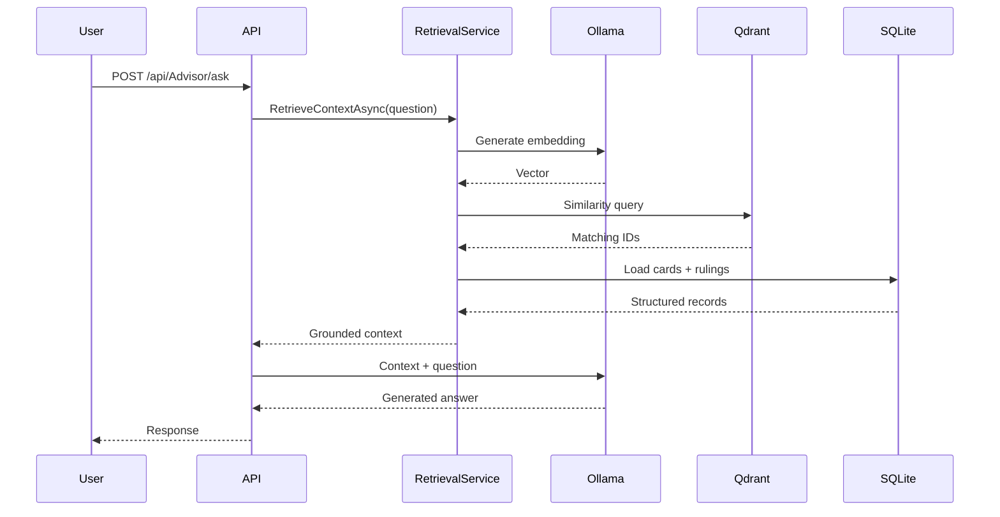

# Architecture

PauperAdvisor uses two complementary storage mechanisms because they solve different problems.

## Relational source of truth

SQLite stores the structured entities used by the application:

- cards
- card faces
- official rulings

Entity Framework Core manages the model and migrations. This database remains the authoritative source when RAG results are assembled.

## Vector retrieval

Qdrant stores embeddings for cards and rulings together with lightweight metadata such as `oracle_id`, document type and card name.

A user question is embedded through Ollama and used for a similarity query. The resulting Oracle IDs are then resolved back to SQLite. This prevents the vector database from becoming a second independent copy of all application data.

## Question-answering flow

## Matchup-analysis flow

The matchup endpoint accepts a board screenshot, a main deck list and a sideboard list.

1. The screenshot is sent to the configured vision-capable Ollama model.
2. The model is asked to return only candidate card names.
3. Candidate names are validated against the SQLite card database.
4. Confirmed opponent cards, the main deck and sideboard are included in a constrained strategy prompt.
5. The model returns the proposed matchup analysis and sideboard swap.

This validation step reduces the chance that visual extraction introduces nonexistent card names into the strategy stage.

## Project boundaries

### `PauperAdvisor.Domain`

Contains the domain entities and has no infrastructure responsibilities.

### `PauperAdvisor.Data`

Contains the EF Core context, migrations and dataset-seeding logic.

### `PauperAdvisor.RAG`

Contains model integration, embeddings, semantic retrieval and Qdrant storage logic.

### `PauperAdvisor.Api`

Composes dependencies and exposes the HTTP API.

### `PauperAdvisor.Importer`

Provides a command-line entry point for creating/populating the local relational database from external datasets.

## Configuration strategy

Machine-specific paths are not embedded in source code. Local defaults live in `appsettings.json`, while ASP.NET Core environment variables can override them in other environments.

This keeps the repository portable and prevents local workstation paths or database files from being committed.
